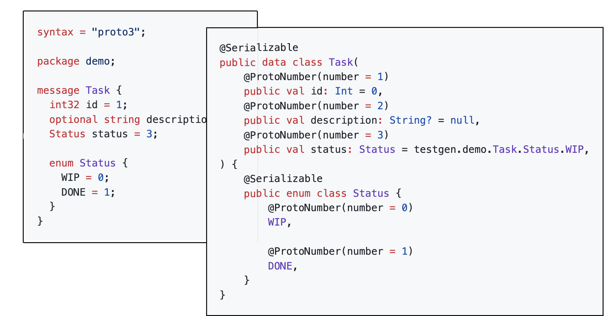

# kotlinx-protobuf-gen


[](https://github.com/Dogacel/kotlinx-protobuf-gen/actions/workflows/build.yaml)
[](https://codecov.io/gh/Dogacel/kotlinx-protobuf-gen)
[](https://opensource.org/licenses/Apache-2.0)
[](https://github.com/dogacel/kotlinx-protobuf-gen/contributors)
[](https://github.com/dogacel/kotlinx-protobuf-gen/pulse)

Generate kotlin data classes from `protobuf` files that supports _Kotlin Native_ that can be serialized and
deserialized to protobuf using [kotlinx.serialization](https://github.com/Kotlin/kotlinx.serialization).



## Features

- [x] Supports `proto2`, `proto3` and `editions` up to `2023`.
- [x] Generates `kotlinx.serialization` annotations for proto field numbers and serialization format.
- [x] Generates Kotlin code for primitive fields such as `int32`, `string`, `bytes`.
- [x] Generates Kotlin code for `message`, `enum`, `repeated`, `map`, `oneof` types.
- [x] Generates Kotlin code that includes imports and uses nested types.
- [x] Supports common well-known types such as `Timestamp`, `StringValue` and serializes them to kotlin
  primitives or standards.
- [x] Support Well-Known Types deserialization to Well-Known Kotlin types such as `google.protobuf.Duration`
  to `kotlin.time.Duration` and `google.protobuf.Timestamp` to `kotlinx.datetime.Instant`.
    - An option is added to code generator to enable this feature.
    - More WKT additions will be added.

## Setup

### 1. Dependencies,

```kotlin
plugins {
    kotlin("jvm") version "2.0.0"
    id("org.jetbrains.kotlin.plugin.serialization") version "2.0.0"
    id("com.google.protobuf") version "0.9.4"
}

var protobufVersion = "4.30.0"

dependencies {
    // Runtime libraries include WKT conversion utilities and other libraries that are required such
    // as kotlinx.datetime, kotlinx.coroutines, kotlinx.serialization, etc.
    implementation("io.github.dogacel:kotlinx-protobuf-gen:0.1.0")
}
```

#### 2. Code generation,

```kotlin
protobuf {
    protoc {
        artifact = "com.google.protobuf:protoc:$protobufVersion"
    }

    plugins {
        id("kotlinx-protobuf-gen") {
            artifact = "io.github.dogacel:kotlinx-protobuf-gen:0.1.0:jvm8@jar"
        }
    }

    // Enable Kotlin generation
    generateProtoTasks {
        all().forEach {
            it.builtins {
                remove("java") // Optionally you can keep the java generated files.
            }
            it.plugins {
                id("kotlinx-protobuf-gen") {
                    option("package_prefix=custom.pkg") // Set a custom package prefix
                }
            }
        }
    }
}
```

#### 3. Writing proto files,

Add your proto files to a known proto file path such as `src/main/proto`.

```protobuf
syntax = "proto3";

package demo;

message Task {
  int32 id = 1;
  optional string description = 2;
  Status status = 3;

  enum Status {
    WIP = 0;
    DONE = 1;
  }
}
```

The following class will be generated and added to your classpath.

```kotlin
@Serializable
public data class Task(
    @ProtoNumber(number = 1)
    public val id: Int = 0,
    @ProtoNumber(number = 2)
    public val description: String? = null,
    @ProtoNumber(number = 3)
    public val status: Status = testgen.demo.Task.Status.WIP,
) {
    @Serializable
    public enum class Status {
        @ProtoNumber(number = 0)
        WIP,

        @ProtoNumber(number = 1)
        DONE,
    }
}
```

## Customizations

To customize the code generated, you can pass command line arguments or gradle options. For example,

```kotlin
protobuf {
    protoc {
        artifact = "com.google.protobuf:protoc:$protobufVersion"
    }

    plugins {
        id("kotlinx-protobuf-gen") {
            artifact = "io.github.dogacel:kotlinx-protobuf-gen:0.1.0jvm8@jar"
        }
    }

    // Enable Kotlin generation
    generateProtoTasks {
        all().forEach {
            it.builtins {
                remove("java") // Optionally you can keep the java generated files.
            }
            it.plugins {
                id("kotlinx-protobuf-gen") {
                    option("package_prefix=custom.pkg") // Set a custom package prefix
                }
            }
        }
    }
}
```

### Available Options

| Option             | Description                                                                                                | Default |
|--------------------|------------------------------------------------------------------------------------------------------------|---------|
| `package_prefix`   | Prefix for the generated package names. Appended to the start of each class                                | `""`    |
| `useCamelCase`     | Whether to use the original `snake_case` for proto fields or `camelCase`. Can be either `true` or `false`. | `true`  |
| `generateServices` | Whether to generate abstract gRPC stubs or not. Can be either `true` or `false`.                           | `true`  |


## Roadmap

The goal is to eventually support all features of Protobuf in Kotlin without depending on the Java library. Here
is a list of features we are working on that are required to release first stable version:

- [ ] Proper serialization / deserialization of all types. Check "Known Issues" section below to see all major
  issues.
- [ ] Run full conformance tests on the generated code.
- [ ] Support Protobuf JSON format.
- [ ] Support various options such as `deprecated`, `default`, `json_name`.
- [ ] Auto-generated comments from `.proto` files in the generated code.
- [x] gRPC support.
    - Stub generation is completed but it does not include any functionality to call or receive gRPC yet.
    - It is tricky to support gRPC without depending on the Java library.
- [ ] Plugin and more option support for customizing the generated code. (Such as non-enforced nullability to
  gimmick proto2 required fields based on certain rules)

For the full list, check [issues](./issues)

## Known Issues

An issue to track `kotlinx.serialization`: https://github.com/Kotlin/kotlinx.serialization/issues/2401

Focusing on core functionality, here is a list of known major issues:

- [x] Generated `oneof` fields are flattened and not serialized correctly.
    - A flat list of oneof fields is generated. Validation happen in `init` block to make sure at most one
      field is set. One caveat is overlapping names which we can consider later.
    - Will consider sealed traits in the future.
- [ ] Generated `repeated` fields with `fixedXX`, `sfixedXX` and `uintXX` types can't be serialized.
- [ ] Generated `repeated` fields with `sintXX` deserializes incorrectly.
- [ ] Generated `map` fields with `fixedXX` and `sfixedXX` keys can't be serialized.
- [x] Generated `enum` fields with negative values can't be serialized / deserialized.
- [ ] Make data classes with `ByteArray` implement equals and hashcode correctly.

## Releasing

> [!NOTE]
> This section is applicable to official maintainers only.

1. Update `version` under root `build.gradle.kts`.
2. Make sure you set `SONATYPE_USERNAME`, `SONATYPE_PASSWORD`, `GPG_SIGNING_KEY` and `GPG_SIGNING_PASSPHRASE`.
2. `./gradlew publishToSonatype`
3. `./gradlew findSonatypeStagingRepository closeSonatypeStagingRepository`
4. `./gradlew findSonatypeStagingRepository releaseSonatypeStagingRepository`

For any errors, visit https://s01.oss.sonatype.org/#stagingRepositories.

### Snapshots

After you release a `-SNAPSHOT` version, you need the following block to import it.

```kotlin
repositories {
    maven {
        this.url = uri("https://s01.oss.sonatype.org/content/repositories/snapshots/")
    }
}
```

## Contribution

For starters, start by checking [issues](./issues).

There are two main components to this project. One is the code generator and the other is the generated code
tests.

- Code generator can be found under [app](./app) folder.
    - There are several smaller classes / objects that are used to help manage the complexity of the code.
    - Entry point is in `App.kt`. Start reading the code by inspecting the entry point, it should be fairly
      straight-forward to understand.
- Generated code tests can be found under [generated-code-tests](./generated-code-tests) folder.
    - This is a separate subproject makes sure we are not breaking the compilation of our main app when the
      generated code is not compiling after making some changes.
    - We store the generated code in version control showcase and review the generated code.
    - Make sure you run `./gradlew build` after you modify the code to generate the newest files. If newest files are
      not committed, the CI check will fail.

Linting can be done via

```bash
./gradlew ktlintFormat
```

Building the whole project,

```bash
./gradlew build
```

Check coverage of the code,

```bash
./gradlew koverHtmlReport
```

Please feel free to open issues and PRs.
