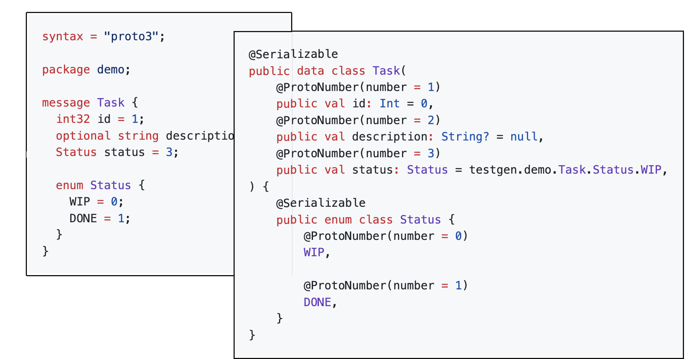

# kotlinx-protobuf-gen

[](https://github.com/Dogacel/kotlinx-protobuf-gen/actions/workflows/build.yaml)

Generate kotlin data classes from `protobuf` files that supports _Kotlin Native_ that can be serialized and
deserialized to protobuf using [kotlinx.serialization](https://github.com/Kotlin/kotlinx.serialization).

> [!NOTE]  
> Full documentation for the project including setup instruction can be found
> at [GitHub Pages](https://dogacel.github.io/kotlinx-protobuf-gen).



## Features

- [x] Supports `proto2` and `proto3`.
- [x] Generates `kotlinx.serialization` annotations for proto field numbers and serialization format.
- [x] Generates Kotlin code for primitive fields such as `int32`, `string`, `bytes`.
- [x] Generates Kotlin code for `message`, `enum`, `repeated`, `map`, `oneof` types.
- [x] Generates Kotlin code that includes imports and uses nested types.

## Roadmap

I will probably move those stuff to issues and projects later on. For now, here is a list of stuff that I have
been thinking about,

Our goal is to eventually support all features of Protobuf in Kotlin without depending on the Java library. Here
is a list of features we are working on that are required to release first stable version.

- [ ] Proper serialization / deserialization of all types. Check "Known Issues" section below to see all major
  issues.
- [ ] Make data classes with `ByteArray` implement equals and hashcode correctly.
- [ ] Run full conformance tests on the generated code.

And here is a list of features that we are planning to work on after the first stable release.

- [x] Support Well-Known Types deserialization to Well-Known Kotlin types such as `google.protobuf.Duration`
  to `kotlin.time.Duration` and `google.protobuf.Timestamp` to `kotlinx.datetime.Instant`.
    - An option is added to code generator to enable this feature.
- [ ] Support various options such as `deprecated`, `default`, `json_name`.
- [ ] Auto-generated comments from `.proto` files in the generated code.
- [ ] Support Protobuf JSON format by default.
- [x] gRPC support.
    - Stub generation is completed but it does not include any functionality to call or receive gRPC yet.
- [ ] Plugin and more option support for customizing the generated code. (Such as non-enforced nullability to
  gimmick proto2 required fields based on certain rules)

## Known Issues

An issue to track `kotlinx.serialization`: https://github.com/Kotlin/kotlinx.serialization/issues/2401

Focusing on core functionality, here is a list of known major issues:

- [x] Generated `oneof` fields are flattened and not serialized correctly.
    - A flat list of oneof fields is generated. Validation happen in `init` block to make sure at most one
      field is set. One caveat is overlapping names which we can consider later.
    - Will consider sealed traits in the future.
- [ ] Generated `repeated` fields with `fixedXX`, `sfixedXX` and `uintXX` types can't be serialized.
- [ ] Generated `repeated` fields with `sintXX` deserializes incorrectly.
- [ ] Generated `map` fields with `fixedXX` and `sfixedXX` keys can't be serialized.
- [ ] Generated `enum` fields with negative values can't be serialized / deserialized.
    - PR opened in `kotlinx.serialization`: https://github.com/Kotlin/kotlinx.serialization/pull/2400

## Contribution

For starters, start by checking [issues](./issues).

There are two main components to this project. One is the code generator and the other is the generated code
tests.

- Code generator can be found under [app](./app) folder.
    - There are several smaller classes / objects that are used to help manage the complexity of the code.
    - Entry point is in `App.kt`. Start reading the code by inspecting the entry point, it should be fairly
      straight-forward to understand.
- Generated code tests can be found under [generated-code-tests](./generated-code-tests) folder.
    - This is a separate subproject makes sure we are not breaking the compilation of our main app when the
      generated code is not compiling after making some changes.
    - We store the generated code in version control showcase and review the generated code.

Linting can be done via

```bash
./gradlew ktlintFormat
```

Building the whole project,

```bash
./gradlew build
```

Check coverage of the code,

```bash
./gradlew koverHtmlReport
```

Please feel free to open issues and PRs.
